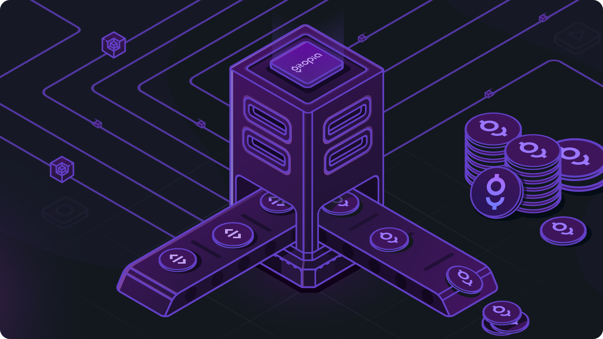

# Gitopia mainnet genesis ceremony

This repo contains instructions for genesis validators to create genesis
staking transactions (gentxs) to start the Gitopia mainnet.



## Instructions

The steps to create a validator in the genesis event of Gitopia are as follows:

1. Install gitopiad

The first step is to install the Gitopia binary, `gitopiad`. Get the latest release or build the binary yourselves using the source code [here](https://github.com/gitopia/gitopia) to install `gitopiad` in your system.

2. Fork this repo and clone

Once you have installed the Gitopia binary, you need to fork this repository and clone it to your local machine. The Gitopia genesis repository contains the initial configuration and parameters for the Gitopia blockchain.

3. Verify genesis file and create gentx transaction

Copy the `pre-genesis.json` to gitopia home directory and verify the correctness of the configuration by running the following command:

```bash
cp pre-genesis.json ~/.gitopiad/config/genesis.json
gitopiad validate-genesis
```

Once you have verified the genesis file, you need to create a gentx transaction. A gentx transaction is a special type of transaction that allows you to become a validator on the Gitopia network. To create a gentx transaction, run the following command:

```bash
gitopiad gentx \
  --amount <amount_of_delegation_uatom> \
  --commission-rate <commission_rate> \
  --commission-max-rate <commission_max_rate> \
  --commission-max-change-rate <commission_max_change_rate> \
  --pubkey <consensus_pubkey> \
  --name <key_name>

```

This will produce a file in the `~/.gitopiad/config/gentx/` folder that has a name with the format `gentx-<node_id>.json`. The content of the file should have a structure as follows:

```bash
{
  "type": "auth/StdTx",
  "value": {
    "msg": [
      {
        "type": "cosmos-sdk/MsgCreateValidator",
        "value": {
          "description": {
            "moniker": "<moniker>",
            "identity": "",
            "website": "",
            "details": ""
          },
          "commission": {
            "rate": "<commission_rate>",
            "max_rate": "<commission_max_rate>",
            "max_change_rate": "<commission_max_change_rate>"
          },
          "min_self_delegation": "1",
          "delegator_address": "cosmos1msz843gguwhqx804cdc97n22c4lllfkk39qlnc",
          "validator_address": "cosmosvaloper1msz843gguwhqx804cdc97n22c4lllfkk5352lt",
          "pubkey": "<consensus_pubkey>",
          "value": {
            "denom": "uatom",
            "amount": "100000000000"
          }
        }
      }
    ],
    "fee": {
      "amount": null,
      "gas": "200000"
    },
    "signatures": [
      {
        "pub_key": {
          "type": "tendermint/PubKeySecp256k1",
          "value": "AlT62zuYGlZGUG3Yv0RtIFoPTzVY4N+WEFmBvz1syjws"
        },
        "signature": ""
      }
    ],
    "memo": ""
  }
}
```

4. Commit and push gentx transaction in the forked repo

After creating your gentx transaction, you need to commit and push it to your forked Gitopia repository.

5. Create a pull request (PR)

The final step in the genesis event of Gitopia is to create a pull request (PR) to submit your gentx transaction to the Gitopia genesis repository. In the PR description, provide details about your validator and your gentx transaction. Once your PR is merged, your gentx transaction will be included in the Gitopia genesis file, and you will become a validator on the Gitopia network at genesis.

Note that we'll accept PRs only from the known validators to ensure that 2/3 of the voting power is online at the time of genesis. Others are free to join as a validator once the chain is live.

## A Note about your Validator Signing Key
Your validator signing private key lives at ~/.gitopiad/config/priv_validator_key.json. If this key is stolen, an attacker would be able to make your validator double sign, causing a slash of 5% of your LORE tokens and the tombstoning of your validator.

## Next Steps
Wait for the next release for the `gitopiad` binary and be ready to come online at the recommended time.

At genesis time, the bonded Proof-of-Stake system will kick in to determine the initial validator set (max 100 validators) from the set of gentx transactions. More than 2/3 of the voting power of this set must be online and participating in consensus in order to create the first block and start the gitopia mainnet.

We expect and hope that LORE holders will exercise discretion in initial staking to ensure the network does not ever become excessively centralized as we move steadily to the target of 66% LORE tokens staked. We hope to bootstrap as a decentralized community.

# Disclaimer

The gitopiad is experimental software. In these early days, we can expect to have issues, updates, and bugs. The existing tools require advanced technical skills and involve risks which are outside of the control of the Gitopia team. Any use of this open source Apache 2.0 licensed software is done at your *own risk and on a “AS IS” basis, without warranties or conditions of any kind*, and any and all liability of the Gitopia team for damages arising in connection to the software is excluded. **Please exercise extreme caution!**
